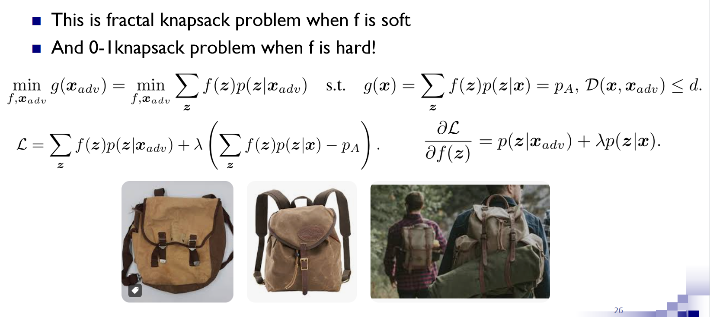

<!--  -->

**Talker**: [Huanran Chen](https://huanranchen.github.io/)
**Bio**: Huanran Chen is a PhD student from TSAIL (Fall 2025), advised by Prof. Jun Zhu, and closely collaborate with Prof. [Yinpeng Dong]. He has a keen interest in the physics of machine learning. His unattainable yet motivating dream is to elevate AI to the realm of science, making every phenomenon explainable and predictable.

**Key note**: 
- What is worst-case robustness?
- Why worst-case robustness?
- Upper bounding worst-case robustness
- Lower bounding worst-case robustness (knapsack problem)
- Specific application to text domain
- Theoretical insights (e.g., diffusion>MaskGen>ARM)
- Applications

[slides](./files/Towards the Worst-case Robustness of LLM.pptx)